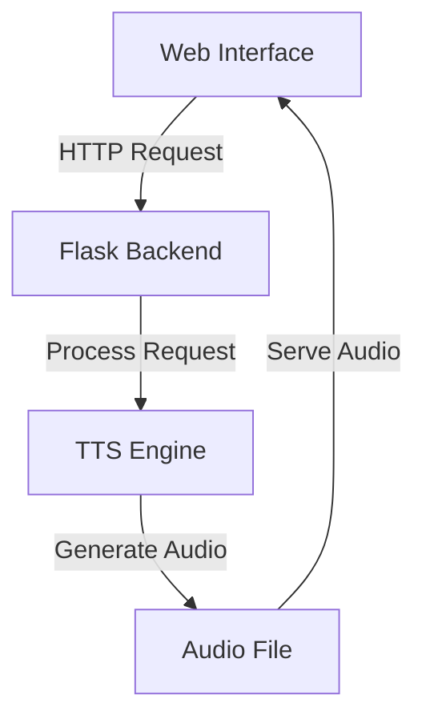

# Complete TTS System Workflow Explanation

## Table of Contents
1. [System Overview](#system-overview)
2. [Frontend Implementation](#frontend-implementation)
3. [Backend Implementation](#backend-implementation)
4. [Audio Generation Pipeline](#audio-generation-pipeline)
5. [Error Handling](#error-handling)
6. [File Structure](#file-structure)

## System Overview

The Text-to-Speech (TTS) system consists of three main components:
1. Web Interface (`templates/index.html`)
2. Flask Backend (`app.py`)
3. TTS Engine (`Fastspeech2_HS/inference.py`)



## Frontend Implementation

### File: `templates/index.html`

1. **User Interface Components**
   ```html
   <!-- Language Selection -->
   <select class="form-select" id="language" name="language">
     <option value="marathi">Marathi</option>
     <option value="hindi">Hindi</option>
     <!-- ... other languages ... -->
   </select>

   <!-- Gender Selection -->
   <select class="form-select" id="gender" name="gender">
     <option value="male">Male</option>
     <option value="female">Female</option>
   </select>

   <!-- Speed Control -->
   <input type="range" class="form-range" id="alpha" name="alpha" 
          min="0.5" max="2" step="0.1" value="1">
   ```

2. **JavaScript Implementation**
   ```javascript
   // Form submission handling
   document.getElementById('ttsForm').addEventListener('submit', async (e) => {
     e.preventDefault();
     const formData = new FormData(e.target);
     
     try {
       const response = await fetch('/synthesize', {
         method: 'POST',
         body: formData
       });
       
       const data = await response.json();
       if (data.status === 'success') {
         document.getElementById('audioPlayer').src = data.audio_path;
         document.getElementById('audioContainer').style.display = 'block';
       }
     } catch (error) {
       console.error('Error:', error);
     }
   });
   ```

## Backend Implementation

### File: `app.py`

1. **Flask Routes**
   ```python
   @app.route('/')
   def home():
       return render_template('index.html')

   @app.route('/synthesize', methods=['POST'])
   def synthesize():
       try:
           # Get form data
           text = request.form['text']
           language = request.form['language']
           gender = request.form['gender']
           alpha = float(request.form.get('alpha', 1.0))
           
           # Generate output filename
           filename = f'output_{language}_{gender}.wav'
           output_file = os.path.join(app.config['UPLOAD_FOLDER'], filename)
           
           # Run TTS inference
           inference_dir = os.path.join(current_dir, 'Fastspeech2_HS')
           cmd = [
               'python',
               'inference.py',
               '--sample_text', text,
               '--language', language,
               '--gender', gender,
               '--alpha', str(alpha),
               '--output_file', output_file
           ]
           
           process = subprocess.run(cmd, check=True, cwd=inference_dir)
           
           return jsonify({
               'status': 'success',
               'audio_path': f'/static/audio/{filename}'
           })
           
       except Exception as e:
           return jsonify({
               'status': 'error',
               'message': str(e)
           }), 500
   ```

## Audio Generation Pipeline

### File: `Fastspeech2_HS/inference.py`

1. **Text Processing Stage**
   ```python
   # Load preprocessor based on language
   preprocessor = preprocessors.get(language, preprocessors['default'])
   
   # Convert text to phonemes
   preprocessed_text, phrases = preprocessor.preprocess(
       sample_text, 
       language, 
       gender, 
       phone_dictionary
   )
   ```

2. **Model Loading**
   ```python
   def load_fastspeech2_model(language, gender, device):
       # Load model configuration
       config_path = f"{language}/{gender}/model/config.yaml"
       with open(config_path, "r") as file:
           config = yaml.safe_load(file)
       
       # Load model weights
       model_path = f"{language}/{gender}/model/model.pth"
       return Text2Speech(
           train_config=config,
           model_file=model_path,
           device=device
       )
   ```

3. **Audio Generation**
   ```python
   def text_synthesis(language, gender, text, vocoder, max_wav_value, device, alpha):
       # Load FastSpeech2 model
       model = load_fastspeech2_model(language, gender, device)
       
       # Generate mel-spectrogram
       with torch.no_grad():
           out = model(text, decode_conf={"alpha": alpha})
           x = out["feat_gen_denorm"].T.unsqueeze(0) * 2.3262
           
           # Convert to waveform using HiFi-GAN
           y_g_hat = vocoder(x)
           audio = y_g_hat.squeeze()
           audio = audio * max_wav_value
           audio = audio.cpu().numpy().astype('int16')
           
       return audio
   ```

## Error Handling

1. **Model File Validation**
   ```python
   def check_model_exists(language, gender):
       model_path = os.path.join(
           'Fastspeech2_HS',
           language,
           gender,
           'model',
           'model.pth'
       )
       return os.path.exists(model_path)
   ```

2. **Phone Dictionary Validation**
   ```python
   def check_phone_dict_exists(language):
       dict_path = os.path.join(
           'Fastspeech2_HS',
           'phone_dict',
           language
       )
       return os.path.exists(dict_path) and os.path.getsize(dict_path) > 0
   ```

## File Structure

```
project/
├── app.py                  # Flask application
├── templates/
│   └── index.html         # Web interface
├── static/
│   └── audio/            # Generated audio files
├── Fastspeech2_HS/
│   ├── inference.py      # TTS inference script
│   ├── text_preprocess_for_inference.py  # Text preprocessing
│   ├── phone_dict/      # Phone dictionaries
│   │   ├── marathi
│   │   ├── hindi
│   │   └── ...
│   └── [language]/      # Language-specific models
│       └── [gender]/    # Gender-specific models
│           └── model/
│               ├── model.pth
│               ├── config.yaml
│               ├── feats_stats.npz
│               ├── pitch_stats.npz
│               └── energy_stats.npz
```

## Audio Generation Steps

1. **User Input Processing**
   - Web interface collects:
     - Text input
     - Language selection
     - Gender selection
     - Speech speed (alpha)

2. **Backend Processing**
   - Flask receives POST request
   - Validates input parameters
   - Checks for required model files
   - Prepares output file path

3. **Text Preprocessing**
   - Loads language-specific preprocessor
   - Converts text to phonemes
   - Handles special characters
   - Processes numbers and punctuation

4. **Model Processing**
   - Loads FastSpeech2 model
   - Generates mel-spectrogram
   - Applies speed modification
   - Handles pitch and energy

5. **Audio Generation**
   - Uses HiFi-GAN vocoder
   - Converts spectrogram to waveform
   - Applies audio normalization
   - Saves as WAV file

6. **Response Handling**
   - Returns audio file path
   - Handles errors gracefully
   - Provides appropriate status codes
   - Manages file cleanup

## Sample Usage Flow

1. **User Interaction**
   ```javascript
   // User enters text: "नमस्कार"
   // Selects: language="marathi", gender="male", alpha=1.0
   ```

2. **API Request**
   ```http
   POST /synthesize
   Content-Type: multipart/form-data
   
   text=नमस्कार
   language=marathi
   gender=male
   alpha=1.0
   ```

3. **Audio Generation**
   ```python
   # Generated file:
   # static/audio/output_marathi_male.wav
   ```

4. **Audio Playback**
   ```javascript
   // Audio player source updated:
   audioPlayer.src = '/static/audio/output_marathi_male.wav'
   ```

This system provides a seamless integration between the web interface and the TTS engine, making it easy for users to generate speech in multiple languages with different voice options. 