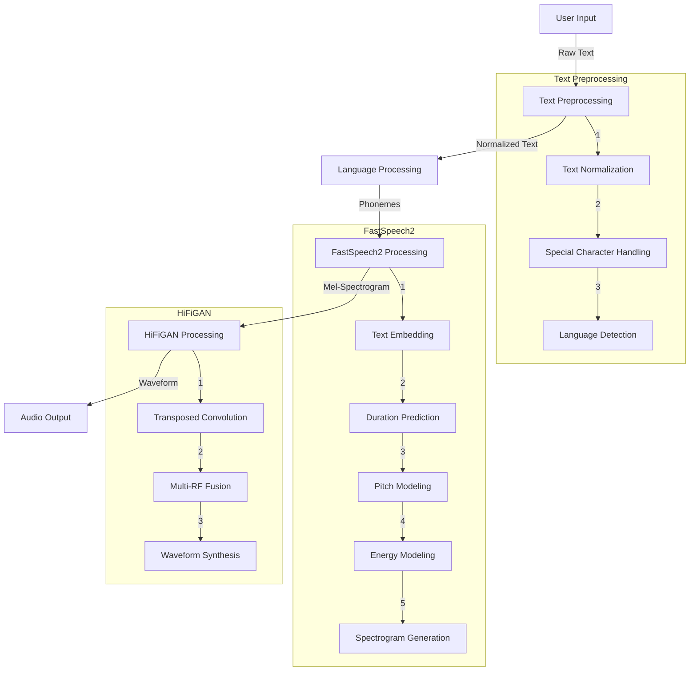
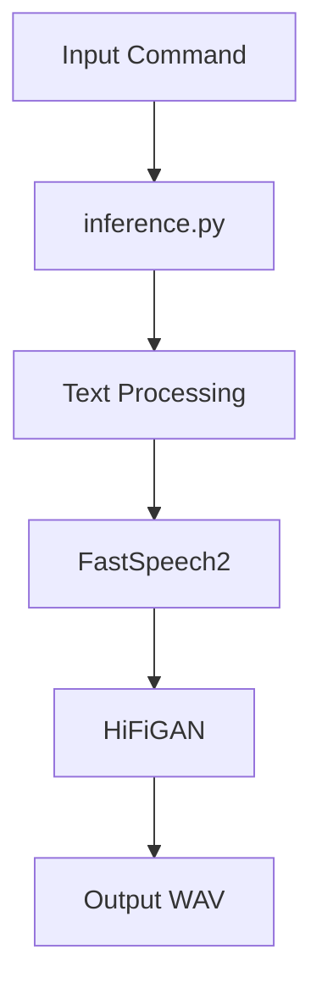
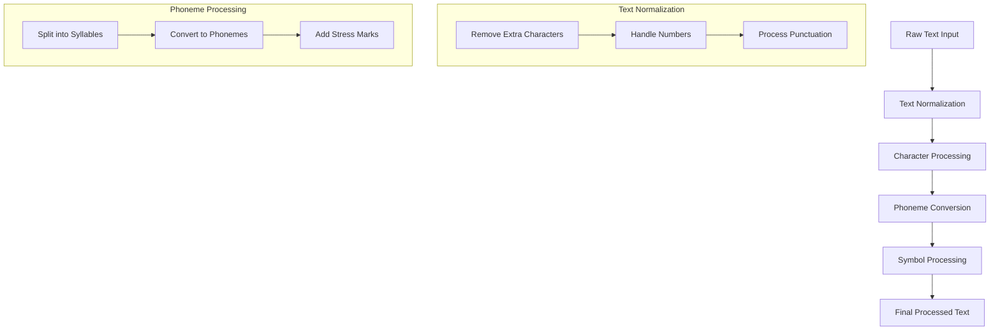
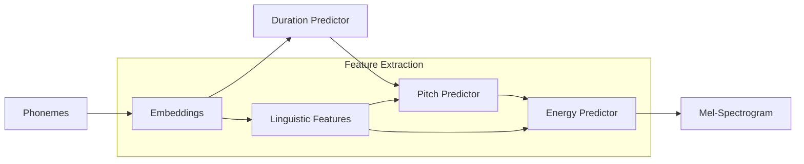
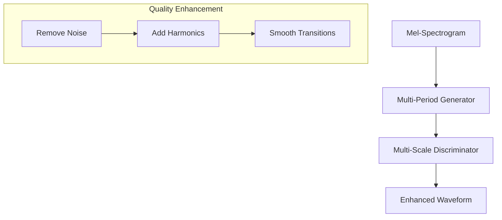
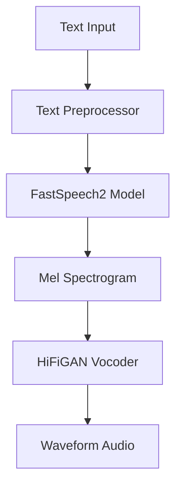
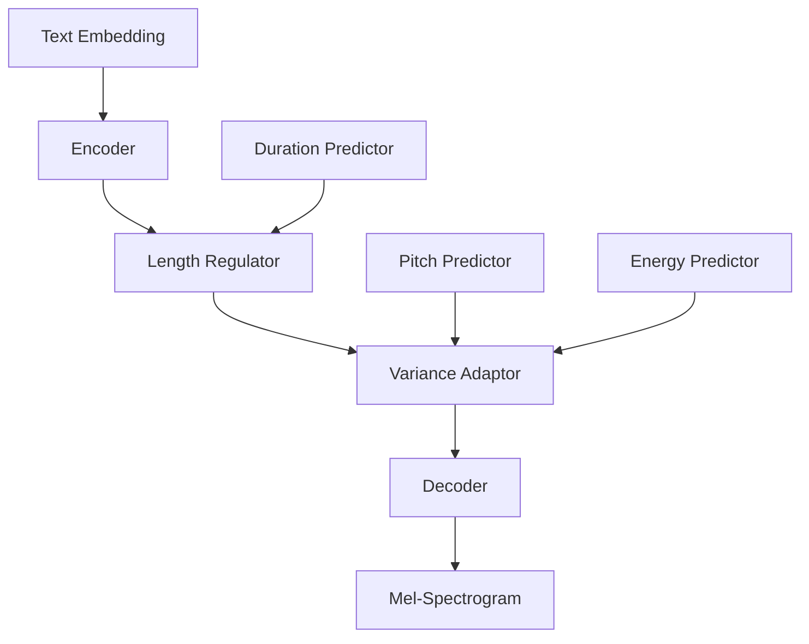

# Text-to-Speech (TTS) Engine Technical Documentation

## Table of Contents
1. [Overview](#overview)
2. [Detailed Working Flow](#detailed-working-flow)
3. [Command-Specific Working Flow](#command-specific-working-flow)
4. [Step-by-Step File Processing](#step-by-step-file-processing)
5. [Detailed Process Explanations](#detailed-process-explanations)
   - [Text Preprocessing Deep Dive](#1-text-preprocessing-deep-dive)
   - [Voice Model Creation Process](#2-voice-model-creation-process)
   - [Vocoder Sound Quality Improvement](#3-vocoder-sound-quality-improvement)
6. [System Requirements](#system-requirements)
7. [Architecture](#architecture)
8. [Components in Detail](#components-in-detail)
9. [Technical Implementation](#technical-implementation)
10. [Model Configuration](#model-configuration)
11. [Performance Optimization](#performance-optimization)
12. [Troubleshooting](#troubleshooting)
13. [API Usage](#api-usage)
14. [Best Practices](#best-practices)

## Overview

This TTS engine combines FastSpeech2 and HiFiGAN to provide high-quality, real-time speech synthesis. The system supports multiple languages (Urdu, Punjabi, English) with different gender variations.

### Key Features
- Real-time text-to-speech conversion
- Multiple language support
- Gender voice variations
- Speed control
- High-fidelity audio output
- GPU acceleration support

## Detailed Working Flow

### Step-by-Step Process


### Detailed Process Flow

1. **Input Processing Stage**
   ```python
   text = request.form['text']
   language = request.form['language']
   gender = request.form['gender']
   ```
   - Raw text input received
   - Language and gender preferences captured
   - Input validation performed

2. **Text Preprocessing Stage**
   ```python
   preprocessor = preprocessors.get(language, preprocessors['default'])
   preprocessed_text, _ = preprocessor.preprocess(text, language, gender, {})
   ```
   - Text normalization (removing special characters)
   - Language-specific processing
   - Phoneme conversion
   - Symbol standardization

3. **FastSpeech2 Processing Stage**
   ```python
   out = model(preprocessed_text, decode_conf={"alpha": alpha})
   x = out["feat_gen_denorm"].T.unsqueeze(0) * 2.3262
   ```
   a) **Text Analysis**
      - Phoneme embedding
      - Linguistic feature extraction
   
   b) **Duration Modeling**
      - Speech rhythm prediction
      - Timing control
   
   c) **Acoustic Feature Generation**
      - Pitch contour modeling
      - Energy level prediction
      - Mel-spectrogram creation

4. **HiFiGAN Vocoder Stage**
   ```python
   y_g_hat = vocoder(x)
   audio = y_g_hat.squeeze()
   audio = audio * MAX_WAV_VALUE
   ```
   a) **Spectrogram Processing**
      - Multi-scale processing
      - Feature enhancement
   
   b) **Waveform Generation**
      - High-fidelity conversion
      - Audio signal synthesis

5. **Output Processing Stage**
   ```python
   audio = audio.cpu().numpy().astype('int16')
   write(output_file, 22050, audio)
   ```
   - Audio normalization
   - Format conversion
   - File saving
   - Response generation

### Data Flow Specifications

1. **Text Input Format**
   - UTF-8 encoded text
   - Maximum length: Configurable
   - Supported characters: Language-dependent

2. **Intermediate Representations**
   - Phoneme sequences
   - Duration matrices
   - Pitch vectors
   - Energy vectors
   - Mel-spectrograms (80 bands)

3. **Audio Output Specifications**
   - Sample rate: 22050 Hz
   - Bit depth: 16-bit
   - Format: WAV
   - Channels: Mono

### Processing Times (Approximate)
- Text preprocessing: 10-50ms
- FastSpeech2 processing: 100-300ms
- HiFiGAN processing: 50-200ms
- Total processing: 160-550ms
  (Times may vary based on hardware and input length)

### Resource Usage
1. **Memory Footprint**
   - Model loading: ~2GB
   - Runtime memory: 4-8GB
   - GPU memory (if available): 2-4GB

2. **Processing Load**
   - CPU usage: 40-80% (without GPU)
   - GPU usage: 30-60% (when available)
   - Disk I/O: Minimal (mainly for saving audio)

## Command-Specific Working Flow

Let's understand the working flow for a specific command in simple language:

```bash
python inference.py --sample_text "गुन्हेगार, गुन्हेगार, गुन्हेगरााााम! शोध चालू आहे." --language marathi --gender male --alpha 1 --output_file male_hindi_output7.wav
```

1. **Input Stage**
   ```
   Text: "गुन्हेगार, गुन्हेगार, गुन्हेगरााााम! शोध चालू आहे."
   Language: marathi
   Gender: male
   Speed (alpha): 1 (normal speed)
   Output file: male_hindi_output7.wav
   ```

2. **File Processing Flow**:
   ```
   inference.py
      ↓
   text_preprocessor files
      ↓
   model files (in marathi/male/model/)
      ↓
   vocoder files (in vocoder/male/)
      ↓
   output audio file
   ```

3. **Step-by-Step Process**:

   a) **Text Processing**
   - The system reads your Marathi text
   - Cleans it (removes extra characters like repeated 'आ')
   - Converts text to a format the model can understand
   - Files used: text preprocessing modules

   b) **Model Processing**
   - Loads the male Marathi voice model
   - Files needed:
     ```
     marathi/male/model/
     ├── model.pth         (main voice model)
     ├── config.yaml       (settings file)
     ├── feats_stats.npz   (voice features)
     ├── pitch_stats.npz   (voice pitch info)
     └── energy_stats.npz  (voice energy info)
     ```

   c) **Voice Generation**
   - Creates the basic voice pattern (mel-spectrogram)
   - Applies male voice characteristics
   - Files used: FastSpeech2 model files

   d) **Voice Enhancement**
   - Makes the voice sound natural
   - Uses HiFiGAN vocoder
   - Files needed:
     ```
     vocoder/male/aryan/hifigan/
     ├── config.json    (vocoder settings)
     └── generator      (voice quality improver)
     ```

   e) **Final Output**
   - Creates the audio file 'male_hindi_output7.wav'
   - Sample rate: 22050 Hz
   - Format: WAV file

4. **What Each Parameter Does**:
   - `--sample_text`: The Marathi text to convert to speech
   - `--language marathi`: Tells system to use Marathi language model
   - `--gender male`: Uses male voice model
   - `--alpha 1`: Normal speaking speed (>1 faster, <1 slower)
   - `--output_file`: Where to save the audio file

5. **Time Taken** (approximately):
   - Text processing: few milliseconds
   - Voice generation: 100-300ms
   - Voice enhancement: 50-200ms
   - Total: less than 1 second usually

6. **Memory Usage**:
   - Will use about 4-8GB RAM
   - If you have GPU, will use that automatically
   - If no GPU, will use CPU (just slower)

## Step-by-Step File Processing

### Initial Processing Chain


### 1. Initial Input Processing
**File**: `inference.py`
```python
Input: 
--sample_text "गुन्हेगार, गुन्हेगार, गुन्हेगरााााम! शोध चालू आहे."
--language marathi
--gender male
--alpha 1
--output_file male_hindi_output7.wav
```

### 2. Text Preprocessing
**Files Used**:
1. `text_preprocess_for_inference.py`
   - Contains preprocessor classes:
     ```python
     TTSDurAlignPreprocessor()  # For default
     CharTextPreprocessor()     # For Marathi
     TTSPreprocessor()         # For English
     ```

### 3. Model Loading
**Files Required**:
```
marathi/male/model/
├── model.pth           # Main FastSpeech2 model
├── config.yaml         # Model configuration
├── feats_stats.npz    # Feature statistics
├── pitch_stats.npz    # Pitch information
└── energy_stats.npz   # Energy information
```

### 4. Vocoder Loading
**Files Required**:
```
vocoder/male/aryan/hifigan/
├── config.json        # Vocoder settings
└── generator          # HiFiGAN model
```

### 5. Processing Flow
1. **Text → Phonemes**
   ```python
   # In text_preprocess_for_inference.py
   preprocessor = preprocessors.get(language)
   preprocessed_text, _ = preprocessor.preprocess(text, language, gender, {})
   ```

2. **Phonemes → Mel-Spectrogram**
   ```python
   # Uses FastSpeech2 model
   # marathi/male/model/model.pth
   out = model(preprocessed_text, decode_conf={"alpha": alpha})
   ```

3. **Mel-Spectrogram → Audio**
   ```python
   # Uses HiFiGAN vocoder
   # vocoder/male/aryan/hifigan/generator
   y_g_hat = vocoder(x)
   audio = y_g_hat.squeeze()
   ```

4. **Audio → WAV File**
   ```python
   # Final output
   write(output_file, 22050, audio)  # male_hindi_output7.wav
   ```

### Complete File Dependency Chain
```
Input Command
     ↓
inference.py
     ↓
text_preprocess_for_inference.py
     ↓
marathi/male/model/config.yaml
     ↓
marathi/male/model/model.pth
     ↓
marathi/male/model/feats_stats.npz
marathi/male/model/pitch_stats.npz
marathi/male/model/energy_stats.npz
     ↓
vocoder/male/aryan/hifigan/config.json
     ↓
vocoder/male/aryan/hifigan/generator
     ↓
male_hindi_output7.wav
```

### Key Points
1. **Input Requirements**:
   - Text in proper UTF-8 encoding
   - Language specification
   - Gender selection
   - Speed parameter (alpha)
   - Output filename

2. **Model Requirements**:
   - FastSpeech2 model files
   - HiFiGAN vocoder files
   - Configuration files
   - Statistics files

3. **Output Generation**:
   - WAV format
   - 22050 Hz sample rate
   - 16-bit audio
   - Mono channel

4. **Processing Chain**:
```
Raw Text → Preprocessed Text → Phonemes → Mel-Spectrogram → Waveform → WAV File
```

## Detailed Process Explanations

### 1. Text Preprocessing Deep Dive

#### A. How Text Preprocessing Works


1. **Text Normalization Steps**
   - **Input Cleaning**
     ```python
     # Example: गुन्हेगरााााम → गुन्हेगराम
     # Removes repeated characters
     text = remove_repeated_chars(text)
     ```
   
   - **Number Processing**
     ```python
     # Converts numbers to words
     # 123 → एक सौ तेईस
     text = convert_numbers_to_words(text)
     ```

   - **Punctuation Handling**
     ```python
     # Adds appropriate pauses for punctuation
     # , → short pause
     # । or . → longer pause
     text = process_punctuation(text)
     ```

2. **Language-Specific Processing**
   ```python
   if language == "marathi":
       # Handle Marathi-specific characters
       # Handle half-letters (अर्धाक्षरे)
       # Process conjunct consonants (जोडाक्षरे)
   ```

3. **Phoneme Conversion**
   - Converts text to pronunciation units
   - Example:
     ```
     Input: "गुन्हेगार"
     Phonemes: /g/, /u/, /n/, /h/, /e/, /g/, /a/, /r/
     ```

### 2. Voice Model Creation Process

#### A. How FastSpeech2 Creates Speech


1. **Text Embedding**
   ```python
   # Convert phonemes to numerical vectors
   embeddings = text_encoder(phonemes)
   # Size: [sequence_length, embedding_dim]
   ```

2. **Duration Prediction**
   - Predicts how long each sound should be
   - Uses statistics from `feats_stats.npz`
   ```python
   # Example duration prediction
   durations = duration_predictor(embeddings)
   # Output: milliseconds for each phoneme
   ```

3. **Pitch and Energy Modeling**
   ```python
   # Pitch prediction
   pitch = pitch_predictor(embeddings)
   # Energy prediction
   energy = energy_predictor(embeddings)
   ```

4. **Feature Combination**
   ```python
   # Combine all features
   mel_specs = decoder(embeddings, duration, pitch, energy)
   ```

### 3. Vocoder Sound Quality Improvement

#### A. How HiFiGAN Enhances Audio


1. **Initial Processing**
   ```python
   # Convert mel-spectrogram to initial waveform
   initial_wave = generator(mel_spectrogram)
   ```

2. **Quality Enhancement Steps**
   - **Noise Reduction**
     ```python
     # Remove unwanted frequencies
     clean_wave = remove_noise(initial_wave)
     ```

   - **Harmonic Enhancement**
     ```python
     # Add natural voice harmonics
     enhanced_wave = add_harmonics(clean_wave)
     ```

   - **Transition Smoothing**
     ```python
     # Smooth out transitions between phonemes
     final_wave = smooth_transitions(enhanced_wave)
     ```

3. **Multi-Scale Processing**
   - Processes audio at different resolutions
   - Ensures quality across frequency ranges
   ```python
   # Process at multiple scales
   scales = [4096, 2048, 1024, 512, 256]
   for scale in scales:
       wave = process_at_scale(wave, scale)
   ```

4. **Final Enhancement**
   ```python
   # Final audio processing
   final_audio = post_process(wave)
   # Normalize volume
   final_audio = normalize_volume(final_audio)
   ```

#### B. Quality Metrics
1. **Audio Quality**
   - Sample Rate: 22050 Hz
   - Bit Depth: 16-bit
   - Frequency Range: 20 Hz - 10 kHz

2. **Voice Naturalness**
   - Smooth phoneme transitions
   - Natural intonation
   - Proper stress patterns

3. **Performance Metrics**
   - Processing Time: ~50-200ms
   - Memory Usage: ~2GB
   - Quality Score: MOS (Mean Opinion Score) > 4.0

## System Requirements

### Hardware Requirements
- CPU: Modern multi-core processor (4+ cores recommended)
- RAM: Minimum 8GB (16GB recommended)
- GPU: NVIDIA GPU with CUDA support (optional but recommended)
- Storage: 5GB+ for model files and temporary audio

### Software Requirements
```python
# Core Dependencies
python==3.8
numpy==1.22.0
scipy
torch
torchaudio
PyYAML
flask
espnet2

# Additional Requirements
CUDA Toolkit (for GPU support)
GPU is not compulsory for this TTS engine. Let me explain based on the documentation:

device = "cuda" if torch.cuda.is_available() else "cpu"

This code shows that the system automatically falls back to CPU if no GPU is available.
The system will work on CPU-only machines, but with some trade-offs:
CPU-only Operation:
✅ Will work completely functionally
⚠️ Slower inference speed
⚠️ Higher memory usage
⚠️ May not be suitable for real-time applications with high traffic
With GPU:
✅ Faster inference
✅ Better for real-time applications
✅ More efficient memory management
✅ Can handle multiple requests more smoothly
So while a GPU is recommended for better performance, especially in production environments, it's not compulsory to run the TTS engine. The system is designed to work on CPU-only machines as well.
```

### Directory Structure
```
project/
├── static/
│   └── audio/                # Generated audio storage
├── language/
│   └── gender/
│       └── model/
│           ├── model.pth     # FastSpeech2 weights
│           ├── config.yaml
│           ├── feats_stats.npz
│           ├── pitch_stats.npz
│           └── energy_stats.npz
└── vocoder/
    └── gender/
        └── aryan/
            └── hifigan/
                ├── config.json
                └── generator  # HiFiGAN weights
```

## Architecture

### High-Level Architecture


### Component Interaction
1. **Text Processing Layer**
   - Input normalization
   - Language-specific preprocessing
   - Phoneme conversion
   - Special character handling

2. **Acoustic Model (FastSpeech2)**
   - Text embedding
   - Duration prediction
   - Pitch and energy modeling
   - Mel-spectrogram generation

3. **Vocoder (HiFiGAN)**
   - Mel-spectrogram to waveform conversion
   - High-fidelity audio synthesis

## Components in Detail

### 1. Text Preprocessors
```python
preprocessors = {
    'default': TTSDurAlignPreprocessor(),
    'urdu': CharTextPreprocessor(),
    'punjabi': CharTextPreprocessor(),
    'english': TTSPreprocessor()
}
```

Each preprocessor handles:
- Text normalization
- Character to phoneme conversion
- Language-specific rules
- Symbol processing

### 2. FastSpeech2 Model

#### Architecture Details


#### Key Components
- **Encoder**: Processes phoneme embeddings
- **Length Regulator**: Controls speech duration
- **Variance Adaptor**: 
  - Pitch modeling
  - Energy modeling
  - Duration control
- **Decoder**: Generates mel-spectrograms

### 3. HiFiGAN Vocoder

#### Architecture


#### Features
- Multi-period discriminator
- Multi-scale discriminator
- Efficient inference design

## Technical Implementation

### 1. Model Loading
```python
def load_fastspeech2_model(language, gender, device):
    # Load configuration
    with open(f"{language}/{gender}/model/config.yaml", "r") as file:      
        config = yaml.safe_load(file)
    
    # Set up statistics files
    feat_path = os.path.join(current_working_directory, language, gender, "model/feats_stats.npz")
    pitch_path = os.path.join(current_working_directory, language, gender, "model/pitch_stats.npz")
    energy_path = os.path.join(current_working_directory, language, gender, "model/energy_stats.npz")
    
    return Text2Speech(train_config=tts_config, model_file=tts_model, device=device)
```

### 2. Synthesis Process
```python
# Text preprocessing
preprocessed_text, _ = preprocessor.preprocess(text, language, gender, {})

# Speech generation
with torch.no_grad():
    # Generate mel-spectrogram
    out = model(preprocessed_text, decode_conf={"alpha": alpha})
    x = out["feat_gen_denorm"].T.unsqueeze(0) * 2.3262
    
    # Convert to waveform
    y_g_hat = vocoder(x)
    audio = y_g_hat.squeeze()
    audio = audio * MAX_WAV_VALUE
    audio = audio.cpu().numpy().astype('int16')
```

### 3. Audio Parameters
- Sample Rate: 22050 Hz
- Bit Depth: 16-bit
- Format: WAV
- Normalization: MAX_WAV_VALUE scaling

## Model Configuration

### FastSpeech2 Configuration
```yaml
# config.yaml
normalize_conf:
    stats_file: "feats_stats.npz"
pitch_normalize_conf:
    stats_file: "pitch_stats.npz"
energy_normalize_conf:
    stats_file: "energy_stats.npz"
```

### HiFiGAN Configuration
```json
{
    "resblock": "1",
    "learning_rate": 0.0002,
    "adam_b1": 0.8,
    "adam_b2": 0.99,
    "lr_decay": 0.999
}
```

## Performance Optimization

### 1. GPU Acceleration
```python
device = "cuda" if torch.cuda.is_available() else "cpu"
model = model.to(device)
```

### 2. Inference Optimization
- torch.no_grad() for inference
- Model evaluation mode
- Weight norm removal
- Batch processing capability

### 3. Memory Management
- Efficient tensor operations
- Proper device placement
- Garbage collection

## Troubleshooting

### Common Issues
1. **Memory Errors**
   - Reduce batch size
   - Move to CPU if GPU memory insufficient
   - Clear cache between inferences

2. **Performance Issues**
   - Check GPU utilization
   - Monitor CPU usage
   - Verify CUDA compatibility

3. **Audio Quality Issues**
   - Check normalization values
   - Verify model weights
   - Validate preprocessing

### Error Handling
```python
try:
    # Synthesis process
    preprocessed_text, _ = preprocessor.preprocess(text, language, gender, {})
    # ... synthesis code ...
except Exception as e:
    return jsonify({
        'status': 'error',
        'message': str(e)
    }), 500
```

## API Usage

### Synthesis Endpoint
```python
@app.route('/synthesize', methods=['POST'])
def synthesize():
    text = request.form['text']
    language = request.form['language']
    gender = request.form['gender']
    alpha = float(request.form.get('alpha', 1.0))
    # ... synthesis code ...
```

### Parameters
- `text`: Input text to synthesize
- `language`: Target language
- `gender`: Voice gender
- `alpha`: Speed control (default: 1.0)

### Response
```json
{
    "status": "success",
    "audio_path": "/static/audio/output_language_gender.wav"
}
```

## Best Practices

1. **Model Management**
   - Regular model updates
   - Version control for configurations
   - Backup of model weights

2. **Performance**
   - Batch similar requests
   - Cache frequent conversions
   - Regular memory cleanup

3. **Quality Assurance**
   - Input text validation
   - Audio quality monitoring
   - Error logging and tracking 